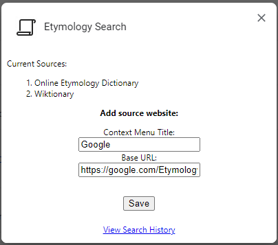

# Etymology Parlor Tricks

A simple Chrome extension for looking up the origins of words. Right click highlighted word and select source website to search its etymology:

Add more source websites:

View history (stored using IndexedDB):

